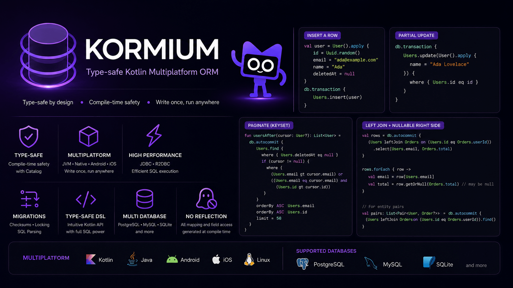

# Kormium



[](https://github.com/kormium/kormium/actions/workflows/ci.yml)
[](https://central.sonatype.com/search?q=g%3Aio.github.kormium)
[](https://kotlinlang.org)
[](LICENSE)

Type-safe ORM and SQL DSL for Kotlin Multiplatform.

Kormium gives you an Exposed-like Kotlin API for tables, entities, typed predicates,
transactions, migrations, joins and aggregations, while keeping the core portable across
JVM and Kotlin/Native. It ships PostgreSQL, MySQL/MariaDB, SQLite, async r2dbc
(PostgreSQL and MySQL) and Ktor integration modules.

```kotlin
object App : Catalog

object Users : Table<App, User>("users", ::User) {
    val id by Column.UUID().primaryKey()
    val name by Column.Text()
    val age by Column.Int()
}

class User : Entity() {
    var id by Users.id
    var name by Users.name
    var age by Users.age
}

val db: Database<App> = createDatabase(
    host = "localhost",
    database = "postgres",
    user = "postgres",
    password = "password",
)

val adults = db.autocommit {
    Users.find {
        where { Users.age gtEq 18 }
        orderBy DESC Users.age
        limit = 50
    }
}
```

## Why Kormium?

- **Multiplatform core.** Write tables, entities, queries and migrations once; run them
  on JVM and Kotlin/Native backends.
- **Typed SQL DSL.** Predicates are built from columns and Kotlin values (`Users.age gtEq
  18`), and values are always bound as parameters.
- **Catalog safety.** A `Table<App, User>` cannot be used inside a `Database<Cache>`
  scope, and the compiler catches that before runtime.
- **Blocking and suspend APIs.** Blocking backends expose `transaction { }` and
  `autocommit { }`; suspend code uses `suspendTransaction { }` and
  `suspendAutocommit { }`.
- **PostgreSQL without JDBC on Native.** JVM uses JDBC/HikariCP, Native uses libpq, and
  r2dbc gives a true async PostgreSQL option on JVM.
- **SQLite for apps, tests and caches.** JVM uses sqlite-jdbc, Native uses sqlite3
  cinterop, Android uses AndroidX SQLite.
- **Reactive queries.** `kormium-observe` turns a query into a `Flow` that re-emits when the
  tables it reads change — for Compose Multiplatform and Android UIs.
- **Server integration.** Ktor helpers are split into DI-agnostic, Ktor DI and Koin
  artifacts.

## Status

**Pre-1.0 — stable core.** The core API is ~90% frozen and covered by tests.
Kormium follows strict [Semantic Versioning](https://semver.org/): any breaking
change before 1.0 is called out explicitly in [CHANGELOG.md](CHANGELOG.md) with a
migration path. You get predictable upgrades, not surprise rewrites.

Requires **JDK 21+** for JVM builds. The JVM suspend offload path uses virtual threads.

## Testing strategy

Every backend is exercised against a **real database**, never a mock or an
in-memory fake standing in for the production engine. The same suite runs across
the platform matrix so a green build means "works on every supported target",
not just on the JVM.

**Integration & end-to-end, on real engines.** On the JVM, the async (r2dbc),
JDBC MySQL and Ktor/Koin/sample backends spin up ephemeral **PostgreSQL** and
**MySQL** instances per run via [Testcontainers](https://testcontainers.com/),
so tests own their database lifecycle and leave nothing behind. SQLite is tested
against a genuine SQLite library (in-memory) on every target.

**Kotlin/Native, against live servers.** Testcontainers is a JVM library, so the
native path takes a different route: the `linuxX64` and `mingwX64` test
executables link the real `libpq` / `libsqlite3` / `libmariadb` and connect to a
**PostgreSQL 16** and **MariaDB 11** server provisioned by CI (service containers
on Linux, the preinstalled PostgreSQL service on Windows). The native drivers are
validated end-to-end, not just compiled.

**Platform matrix (CI).**

| Target | Where it runs | What's verified |
|---|---|---|
| JVM (JDK 21) | Linux + Windows | Unit + integration; both the blocking and the suspend/offload paths |
| Native `linuxX64` | Linux | Native tests against live Postgres, MySQL, SQLite |
| Native `mingwX64` (Windows) | Windows | Native tests against a live Postgres + in-memory SQLite |
| Android + iOS (`iosArm64`/`iosX64`/`iosSimulatorArm64`) | macOS | Klibs cross-compiled for every Compose-Multiplatform module |

Test reports are uploaded as CI artifacts on every run.

## Install

Kormium is published to Maven Central under `io.github.kormium`.

```kotlin
dependencies {
    implementation(platform("io.github.kormium:kormium-bom:<version>"))

    implementation("io.github.kormium:kormium-postgres") // PostgreSQL, JVM + Native
    // implementation("io.github.kormium:kormium-mysql")    // MySQL / MariaDB, JVM + Native
    // implementation("io.github.kormium:kormium-sqlite")   // SQLite, JVM + Native + Android
    // implementation("io.github.kormium:kormium-r2dbc")    // async PostgreSQL + MySQL, JVM only

    // implementation("io.github.kormium:kormium-observe")  // reactive Flow queries
    // implementation("io.github.kormium:kormium-migrate")  // SQL migration runner

    // optional Ktor integration
    // implementation("io.github.kormium:kormium-ktor")
    // implementation("io.github.kormium:kormium-ktor-di")
    // implementation("io.github.kormium:kormium-ktor-koin")
}
```

See [Installation](docs/installation.md) for Gradle variants, native system libraries and
module details.

## Documentation

- [Documentation index](docs/README.md)
- [Installation](docs/installation.md)
- [Quick start](docs/quick-start.md)
- [Tables and entities](docs/tables-and-entities.md)
- [Queries, joins and aggregations](docs/queries.md)
- [Transactions, suspend API and migrations](docs/transactions-and-migrations.md)
- [Backends and platform support](docs/backends.md)
- [Ktor integration](docs/ktor.md)
- [API cookbook](docs/api-cookbook.md)
- [API ergonomics](docs/api-ergonomics.md)
- [Observability](docs/observability.md)
- [Production guide](docs/production-guide.md)
- [Compatibility policy](docs/compatibility.md)
- [Design notes](docs/design.md)
- [Roadmap](docs/roadmap.md)
- [Samples, benchmarks and contributing](docs/project.md)

## Platform Support

| Platform | PostgreSQL | SQLite | Notes |
| --- | --- | --- | --- |
| JVM | JDBC/HikariCP; async r2dbc | sqlite-jdbc | The most stable server target |
| Linux Native | libpq | sqlite3 | Covered by CI native tests |
| macOS Native | libpq | sqlite3 | Published artifacts for x64 and arm64 |
| Android | Not shipped | AndroidX SQLite | `kormium-core` and `kormium-sqlite` compile for Android |
| iOS | Not shipped | sqlite3 | `kormium-core`, `kormium-sqlite` and Ktor integration compile for iOS |
| Windows Native | libpq (experimental) | sqlite3 (experimental) | CI runs JVM + native tests on a Windows runner |
| Wasm | Research | Planned | No shipped backend yet |

## Minimal Workflow

Kormium does not own schema management — create tables with raw SQL or a migration tool.

```kotlin
db.transaction {
    executeUpdate(
        """CREATE TABLE IF NOT EXISTS "users" ("id" uuid NOT NULL, "name" text NOT NULL, "age" integer NOT NULL, PRIMARY KEY ("id"))""",
    )
    Users.insert(User().apply {
        id = Uuid.random()
        name = "Ada"
        age = 36
    })
}

val ada = db.autocommit {
    Users.find {
        where { Users.name like "A%" }
        where { Users.age gtEq 18 }
    }
}
```

For deeper examples, start with [Quick start](docs/quick-start.md) and then read
[Queries](docs/queries.md).

## Samples

Runnable samples live under `samples/`:

| Sample | Shows |
| --- | --- |
| `samples:crud-sqlite` | Standalone SQLite CRUD and migrations |
| `samples:sharding` | Catalog safety and multiple database instances |
| `samples:sqlite-cache` | SQLite cache in front of PostgreSQL |
| `samples:cross-instance-cache` | Cross-instance cache invalidation over Redis (rethis) |
| `samples:ktor-di` | Ktor CRUD with built-in DI |
| `samples:ktor-koin` | Ktor CRUD with Koin |
| `samples:r2dbc` | Ktor CRUD on async r2dbc PostgreSQL |

See [Samples and benchmarks](docs/project.md#samples).

## License

Apache License 2.0. See [LICENSE](LICENSE) and [NOTICE](NOTICE).
